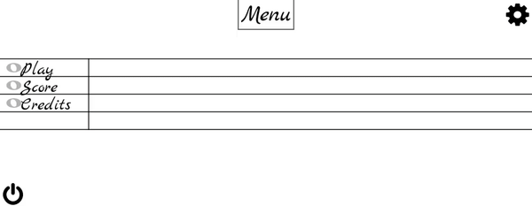

# SolfeGuido

Learn to read a music sheet the fun way !

SolfeGuido was created as a mobile game.
It works on computer, but is more enjoyable on a phone or tablet.

## Features

- Train to read on three keys :
  - G clef
  - F clef
  - F & G clef
  - Ut 3 clef
  - Ut 4 clef

* Many stats are available (and more to come) :
  - Number of games played
  - Number of points won
  - Average reaction time
  - Wrong notes guessed
  - Longest play streak
  - Total time played

## Example

## License

MIT
